<p align="center">
  
</p>

# CREPE — Compile, Research, Export, Presentation Engine

CREPE is a specialized Model Context Protocol (MCP) server designed primarily for **[Goose](https://block.github.io/goose/)** (and fully compatible with other MCP-compliant agents such as Claude Desktop, Antigravity / AGY CLI, and Cursor). It equips AI agents with the tools to draft academic slide decks in Pandoc Markdown, compile publication-grade Beamer PDFs or PowerPoint decks, author multi-chapter A4 research reports, format multi-sheet Excel workbooks, validate and export Draw.io architecture diagrams, and conduct academic literature searches across Semantic Scholar, arXiv, Wikipedia, and the live web.

---

## How It Works

CREPE sits between your AI agent and your system's underlying compilation, rendering, and research tools, exposing stateful in-memory builder engines through standard MCP protocols:

```mermaid
flowchart TD
    subgraph ClientLayer["AI Agent Host"]
        Agent["Goose / AI Agent (MCP Client)"]
    end

    subgraph FastMCPLayer["CREPE Modular FastMCP 3.X Layer"]
        Pres["crepe-presentations<br/>(15 tools)"]
        Docs["crepe-documents<br/>(12 tools)"]
        Research["crepe-research<br/>(6 tools)"]
        Sheets["crepe-spreadsheets<br/>(4 tools)"]
        Diagrams["crepe-diagrams<br/>(3 tools)"]
    end

    subgraph SystemTools["System CLI Engines"]
        Pandoc["Pandoc + LuaLaTeX<br/>(PDF, PPTX, DOCX)"]
        LibreOffice["LibreOffice + PyMuPDF<br/>(PNG Slide Rasterization)"]
        Chromium["Headless Chromium<br/>(Dynamic Web Scraping)"]
        DrawioCLI["draw.io Desktop<br/>(Vector/PNG Export)"]
    end

    subgraph ExternalAPIs["External Research & Web APIs"]
        SemScholar["Semantic Scholar API<br/>(Literature & Citations)"]
        ArxivAPI["arXiv API<br/>(Preprints)"]
        TavilyAPI["Tavily Search API<br/>(Live Web Search)"]
        WikiAPI["Wikipedia REST API<br/>(Encyclopedic Knowledge)"]
    end

    subgraph PythonEngines["Internal Python Engines & Linters"]
        OpenPyXL["openpyxl Engine<br/>(Formatted Spreadsheets)"]
        Linters["In-Memory Linters<br/>(AST & Syntax Validation)"]
    end

    %% Client connection
    Agent <-->|stdio / JSON-RPC| Pres
    Agent <-->|stdio / JSON-RPC| Docs
    Agent <-->|stdio / JSON-RPC| Research
    Agent <-->|stdio / JSON-RPC| Sheets
    Agent <-->|stdio / JSON-RPC| Diagrams

    %% Sub-server specific connections
    Pres --> Linters
    Pres --> Pandoc
    Pres --> LibreOffice

    Docs --> Linters
    Docs --> Pandoc
    Docs --> LibreOffice

    Research --> SemScholar
    Research --> ArxivAPI
    Research --> TavilyAPI
    Research --> WikiAPI
    Research --> Chromium

    Sheets --> OpenPyXL

    Diagrams --> Linters
    Diagrams --> DrawioCLI

    %% Nord Theme Styling
    classDef client fill:#2E3440,stroke:#88C0D0,stroke-width:2px,color:#ECEFF4;
    classDef server fill:#3B4252,stroke:#81A1C1,stroke-width:2px,color:#ECEFF4;
    classDef engine fill:#434C5E,stroke:#8FBCBB,stroke-width:1.5px,color:#ECEFF4;
    classDef api fill:#4C566A,stroke:#A3BE8C,stroke-width:1.5px,color:#ECEFF4;
    classDef internal fill:#434C5E,stroke:#D08770,stroke-width:1.5px,color:#ECEFF4;

    class Agent client;
    class Pres,Docs,Research,Sheets,Diagrams server;
    class Pandoc,LibreOffice,Chromium,DrawioCLI engine;
    class SemScholar,ArxivAPI,TavilyAPI,WikiAPI api;
    class OpenPyXL,Linters internal;
```



---

## FastMCP 3.X Architecture

Built natively on **FastMCP 3.X**, CREPE provides high-reliability agentic pair-authoring:

- **Modular Context Efficiency**: Five independent sub-servers allow agents to mount only the tools required for a specific task, keeping LLM context windows lean and focused.
- **Embedded Agent Instructions**: Initialization prompts inject strict Pandoc Markdown rules, preventing LaTeX syntax hallucinations and formatting errors.
- **Deterministic Concurrency**: FIFO ticket locks and `expected_slide_count` guards prevent race conditions when agents spawn concurrent sub-agents to draft sections simultaneously.
- **Live Inspectable Resources**: Real-time URIs (`presentation://{id}/source`, `document://{id}/config`) enable instant state inspection without tool-call overhead.
- **Scaffolding Prompts**: Standard prompt templates (`academic_presentation`, `technical_report`, `spreadsheet_model`, `drawio_diagram`) bootstrap complex project structures.

---

## Sub-Servers & Tools Overview (40 Tools Total)

| Sub-server | Command Entry Point | Tools | Primary Domain |
|:-----------|:--------------------|:-----:|:---------------|
| **Presentations** | `uv run crepe-presentations` | 15 | Slide deck authoring, Beamer/PPTX compilation, PNG rendering |
| **Documents** | `uv run crepe-documents` | 12 | A4 reports and papers, LaTeX/DOCX compilation, PNG rendering |
| **Research** | `uv run crepe-research` | 6 | Semantic Scholar, arXiv, Tavily web search, Wikipedia |
| **Spreadsheets** | `uv run crepe-spreadsheets` | 4 | Styled Excel workbooks (.xlsx), Markdown table conversion |
| **Diagrams** | `uv run crepe-diagrams` | 3 | Draw.io XML inspection, linting, and headless image export |
| **Monolith** | `uv run crepe-mcp` | **40** | Unified server providing all 40 tools in a single process |

### 1. Presentations (`crepe-presentations` — 15 tools)
Stateful, incremental slide deck builder that compiles Pandoc Markdown into Beamer PDF presentations or PowerPoint files.
- **Deck Lifecycle**: `create_presentation`, `duplicate_presentation`, `cleanup_presentation`, `list_presentations`, `get_presentation`.
- **Slide Manipulation**: `set_slide` (append or insert at index), `get_slide`, `move_slide`, `delete_slide`, `update_presentation_metadata`.
- **Source Synchronization**: `export_presentation_source`, `import_presentation_source` (round-trip markdown editing).
- **Compilation & Verification**: `compile_presentation` (Beamer PDF / PPTX), `render_slides_as_pngs` (high-DPI PNG verification), `lint_presentation`.

### 2. Documents (`crepe-documents` — 12 tools)
Hierarchical report and article authoring engine for structured academic documents.
- **Document Management**: `create_document`, `get_document`, `list_documents`, `cleanup_document`, `update_document_metadata`.
- **Section Structuring**: `set_chapter`, `set_section` (nested subsection support), `delete_chapter`.
- **Compilation & Output**: `export_document_source`, `compile_document` (LuaLaTeX PDF / DOCX), `render_document_as_pngs`, `lint_document`.

### 3. Research & Web Discovery (`crepe-research` — 6 tools)
Literature discovery and live web extraction with built-in rate limit handling.
- **Academic Papers**: `academic_search` (queries Semantic Scholar API with citation counts and rate-limit backoff), `arxiv_search` (queries arXiv API for recent preprints).
- **Encyclopedic Knowledge**: `wikipedia_search` (finds relevant topics), `wikipedia_read` (extracts clean text body).
- **Web Retrieval**: `web_search` (Tavily search integration), `fetch_webpage` (extracts clean markdown with headless Chromium fallback).

### 4. Spreadsheets (`crepe-spreadsheets` — 4 tools)
Programmatic workbook creation with styling, number formatting, and table transformation.
- **Workbook Builder**: `create_excel` (multi-sheet workbooks with column types, colors, and headers), `update_excel_sheet` (append rows or update cells).
- **Inspection & Ingestion**: `inspect_excel` (reads sheets, dimensions, and previews), `markdown_table_to_excel` (converts markdown tables directly to styled `.xlsx`).

### 5. Diagrams (`crepe-diagrams` — 3 tools)
Inspection, deep linting, and export for `.drawio` diagram files.
- **Validation**: `inspect_drawio` (metadata and page structure), `lint_drawio` (validates cell hierarchy, decompresses XML, checks base IDs).
- **Export**: `export_drawio` (headless rasterization to transparent high-DPI PNG, SVG, or PDF).

---

## Setup & Configuration

CREPE includes an automated installer script (`setup.py`) that detects your system dependencies, registers extensions into Goose (and other agents), and configures environment variables.

### Automated Setup

```bash
# Standard installation for Goose and detected agents
./setup.py --install

# Install specifically for Goose
./setup.py --install --target goose

# Install as a single monolith server (40 tools) instead of 5 sub-servers
./setup.py --install --legacy

# Non-interactive installation with API keys and custom paths
./setup.py --install -y \
  --tavily-key "tvly-..." \
  --ss-key "your-semantic-scholar-key" \
  --browser-path "/usr/bin/chromium"

# Uninstall CREPE from all agent configs and shell profiles
./setup.py --uninstall
```

### CLI Options & Configuration Flags

| Flag | Argument | Default | Description |
|:-----|:---------|:--------|:------------|
| `--install` | — | True | Register CREPE MCP servers with client configurations |
| `--uninstall` | — | False | Remove CREPE MCP servers and clean up profile entries |
| `--target` | `goose` `claude` `agy` `all` | `all` | Specify which agent configurations to update |
| `--legacy` | — | False | Install as monolith (`crepe-mcp`) rather than 5 modular sub-servers |
| `-y`, `--non-interactive` | — | False | Accept all defaults and flags without interactive prompts |
| `--tavily-key` | `KEY` | `""` | Tavily API Key for live web search |
| `--ss-key` | `KEY` | `""` | Semantic Scholar API Key for literature searches |
| `--browser-path` | `PATH` | auto | Absolute path to Chromium/Chrome binary for JS page rendering |
| `--libreoffice-path` | `PATH` | auto | Path to LibreOffice binary for PPTX slide rasterization |
| `--drawio-path` | `PATH` | auto | Path to draw.io desktop binary for diagram export |

### Environment Variables

| Variable | Required For | Default / Auto-detection |
|:---------|:-------------|:-------------------------|
| `CREPE_TAVILY_API_KEY` | `web_search` tool | Prompts during setup or reads environment |
| `CREPE_SEMANTIC_SCHOLAR_API_KEY` | `academic_search` rate limits | Optional (public tier used if unset) |
| `CREPE_HEADLESS_BROWSER_PATH` | JavaScript-heavy `fetch_webpage` | Auto-detected from Chromium / Chrome / Brave |
| `CREPE_LIBREOFFICE_PATH` | PPTX to PNG rendering | Auto-detected (`libreoffice` on PATH or Mac App) |
| `CREPE_DRAWIO_PATH` | Headless diagram export | Auto-detected (`drawio` / `draw.io` on PATH) |

---

## System Requirements

- **Python**: `>=3.12`
- **Pandoc**: `>=3.0` (required for markdown compilation to PDF, PPTX, DOCX)
- **LuaLaTeX / TeX Live**: `texlive-full` or MacTeX (required for PDF compilation)
- **LibreOffice**: (Optional / recommended) For rasterizing PPTX slides to PNG sequences
- **Draw.io Desktop**: (Optional / recommended) For headless `.drawio` diagram export

---

## Documentation & References

- **[Online API Reference](https://mariolpantunes.github.io/crepe-mcp/)**: Complete auto-generated documentation built via `pdoc`.
- **[Agent Usage Guide (AGENTS.md)](AGENTS.md)**: Syntax rules, Beamer theme guidelines, and prompt constraints for AI agents using CREPE tools.
- **[Citation Metadata (CITATION.cff)](CITATION.cff)**: Citation instructions for academic research using CREPE.

---

## License

MIT © Mário Antunes
