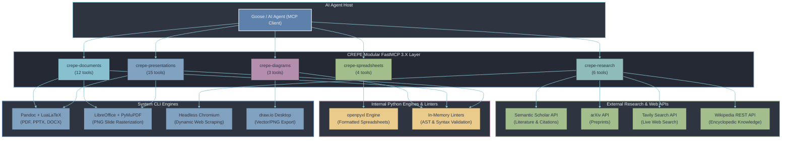

<p align="center">
  
</p>

# CREPE — Compile, Research, Export, Presentation Engine

CREPE is a specialized Model Context Protocol (MCP) server designed primarily for **[Goose](https://block.github.io/goose/)** (and fully compatible with other MCP-compliant agents such as Claude Desktop, Antigravity / AGY CLI, and Cursor). It equips AI agents with the tools to draft academic slide decks in Pandoc Markdown, compile publication-grade Beamer PDFs or PowerPoint decks, author multi-chapter A4 research reports, format multi-sheet Excel workbooks, validate and export Draw.io architecture diagrams, and conduct academic literature searches across Semantic Scholar, arXiv, Wikipedia, and the live web.

---

## How It Works

CREPE sits between your AI agent and your system's underlying compilation, rendering, and research tools, exposing stateful in-memory builder engines through standard MCP protocols:


```mermaid
flowchart TD
    subgraph ClientLayer["AI Agent Host"]
        Agent["Goose / AI Agent (MCP Client)"]
    end

    subgraph FastMCPLayer["CREPE Modular FastMCP 3.X Layer"]
        Pres["crepe-presentations<br/>(15 tools)"]
        Docs["crepe-documents<br/>(12 tools)"]
        Research["crepe-research<br/>(6 tools)"]
        Sheets["crepe-spreadsheets<br/>(4 tools)"]
        Diagrams["crepe-diagrams<br/>(3 tools)"]
    end

    subgraph SystemTools["System CLI Engines"]
        Pandoc["Pandoc + LuaLaTeX<br/>(PDF, PPTX, DOCX)"]
        LibreOffice["LibreOffice + PyMuPDF<br/>(PNG Slide Rasterization)"]
        Chromium["Headless Chromium<br/>(Dynamic Web Scraping)"]
        DrawioCLI["draw.io Desktop<br/>(Vector/PNG Export)"]
    end

    subgraph ExternalAPIs["External Research & Web APIs"]
        SemScholar["Semantic Scholar API<br/>(Literature & Citations)"]
        ArxivAPI["arXiv API<br/>(Preprints)"]
        TavilyAPI["Tavily Search API<br/>(Live Web Search)"]
        WikiAPI["Wikipedia REST API<br/>(Encyclopedic Knowledge)"]
    end

    subgraph PythonEngines["Internal Python Engines & Linters"]
        OpenPyXL["openpyxl Engine<br/>(Formatted Spreadsheets)"]
        Linters["In-Memory Linters<br/>(AST & Syntax Validation)"]
    end

    %% Client connections
    Agent --> Pres
    Agent --> Docs
    Agent --> Research
    Agent --> Sheets
    Agent --> Diagrams

    %% Sub-server specific connections
    Pres --> Linters
    Pres --> Pandoc
    Pres --> LibreOffice

    Docs --> Linters
    Docs --> Pandoc
    Docs --> LibreOffice

    Research --> SemScholar
    Research --> ArxivAPI
    Research --> TavilyAPI
    Research --> WikiAPI
    Research --> Chromium

    Sheets --> OpenPyXL

    Diagrams --> Linters
    Diagrams --> DrawioCLI

    %% Nord Theme High-Contrast Node Styling
    classDef client fill:#5E81AC,stroke:#ECEFF4,stroke-width:2px,color:#ECEFF4;
    classDef pres fill:#81A1C1,stroke:#2E3440,stroke-width:1.5px,color:#2E3440;
    classDef docs fill:#88C0D0,stroke:#2E3440,stroke-width:1.5px,color:#2E3440;
    classDef research fill:#8FBCBB,stroke:#2E3440,stroke-width:1.5px,color:#2E3440;
    classDef sheets fill:#A3BE8C,stroke:#2E3440,stroke-width:1.5px,color:#2E3440;
    classDef diagrams fill:#B48EAD,stroke:#2E3440,stroke-width:1.5px,color:#2E3440;
    classDef engine fill:#81A1C1,stroke:#2E3440,stroke-width:1.5px,color:#2E3440;
    classDef api fill:#A3BE8C,stroke:#2E3440,stroke-width:1.5px,color:#2E3440;
    classDef internal fill:#EBCB8B,stroke:#2E3440,stroke-width:1.5px,color:#2E3440;

    class Agent client;
    class Pres pres;
    class Docs docs;
    class Research research;
    class Sheets sheets;
    class Diagrams diagrams;
    class Pandoc,LibreOffice,Chromium,DrawioCLI engine;
    class SemScholar,ArxivAPI,TavilyAPI,WikiAPI api;
    class OpenPyXL,Linters internal;

    %% Major Subgraph Containers (Distinct Nord Backgrounds & Bold Accent Borders)
    style ClientLayer fill:#2E3440,stroke:#88C0D0,stroke-width:2px,color:#ECEFF4;
    style FastMCPLayer fill:#242933,stroke:#81A1C1,stroke-width:2px,color:#ECEFF4;
    style SystemTools fill:#2E3440,stroke:#5E81AC,stroke-width:2px,color:#ECEFF4;
    style ExternalAPIs fill:#2E3440,stroke:#A3BE8C,stroke-width:2px,color:#ECEFF4;
    style PythonEngines fill:#2E3440,stroke:#B48EAD,stroke-width:2px,color:#ECEFF4;

    %% Link Styling (Bright Frost Cyan)
    linkStyle default stroke:#88C0D0,stroke-width:1.6px;
```

---

## FastMCP Architecture

Built natively on **FastMCP** (3.x and 4.x are both supported; the dependency is
pinned `>=3.0,<5`), CREPE provides high-reliability agentic pair-authoring:

- **Modular Context Efficiency**: Six independent sub-servers allow agents to mount only the tools required for a specific task, keeping LLM context windows lean and focused.
- **Embedded Agent Instructions**: Initialization prompts inject strict Pandoc Markdown rules, preventing LaTeX syntax hallucinations and formatting errors.
- **Deterministic Concurrency**: FIFO ticket locks and `expected_slide_count` guards prevent race conditions when agents spawn concurrent sub-agents to draft sections simultaneously.
- **Live Inspectable Resources**: Real-time URIs (`presentation://{id}/source`, `document://{id}/config`) enable instant state inspection without tool-call overhead.
- **Scaffolding Prompts**: Standard prompt templates (`academic_presentation`, `technical_report`, `spreadsheet_model`, `drawio_diagram`) bootstrap complex project structures.

---

## Sub-Servers & Tools Overview (6 Servers, 48 Tools)

| Sub-server | Command Entry Point | Tools | Primary Domain |
|:-----------|:--------------------|:-----:|:---------------|
| **Presentations** | `venv/bin/crepe-presentations` | 15 | Slide deck authoring, Beamer/PPTX compilation, PNG rendering |
| **Documents** | `venv/bin/crepe-documents` | 12 | A4 reports and papers, LaTeX/DOCX compilation, PNG rendering |
| **Research** | `venv/bin/crepe-research` | 6 | Semantic Scholar, arXiv, Tavily web search, Wikipedia |
| **Spreadsheets** | `venv/bin/crepe-spreadsheets` | 4 | Styled Excel workbooks (.xlsx), Markdown table conversion |
| **Diagrams** | `venv/bin/crepe-diagrams` | 3 | Draw.io XML inspection, linting, and headless image export |
| **Reader** | `venv/bin/crepe-reader` | 8 | Deterministic reading of PDF, DOCX, ODT, EPUB, HTML, LaTeX, Markdown, PPTX, XLSX: outline, pages, search, tables, equations |

### 1. Presentations (`crepe-presentations` — 15 tools)
Stateful, incremental slide deck builder that compiles Pandoc Markdown into Beamer PDF presentations or PowerPoint files.
- **Deck Lifecycle**: `create_presentation`, `duplicate_presentation`, `cleanup_presentation`, `list_presentations`, `get_presentation`.
- **Slide Manipulation**: `set_slide` (append or insert at index), `get_slide`, `move_slide`, `delete_slide`, `update_presentation_metadata`.
- **Source Synchronization**: `export_presentation_source`, `import_presentation_source` (round-trip markdown editing).
- **Compilation & Verification**: `compile_presentation` (Beamer PDF / PPTX), `render_slides_as_pngs` (high-DPI PNG verification), `lint_presentation`.

### 2. Documents (`crepe-documents` — 12 tools)
Hierarchical report and article authoring engine for structured academic documents.
- **Document Management**: `create_document`, `get_document`, `list_documents`, `cleanup_document`, `update_document_metadata`.
- **Section Structuring**: `set_chapter`, `set_section` (nested subsection support), `delete_chapter`.
- **Compilation & Output**: `export_document_source`, `compile_document` (LuaLaTeX PDF / DOCX), `render_document_as_pngs`, `lint_document`.

### 3. Research & Web Discovery (`crepe-research` — 6 tools)
Literature discovery and live web extraction with built-in rate limit handling.
- **Academic Papers**: `academic_search` (queries Semantic Scholar API with citation counts and rate-limit backoff), `arxiv_search` (queries arXiv API for recent preprints).
- **Encyclopedic Knowledge**: `wikipedia_search` (finds relevant topics), `wikipedia_read` (extracts clean text body).
- **Web Retrieval**: `web_search` (Tavily search integration), `fetch_webpage` (extracts clean markdown with headless Chromium fallback).

### 4. Spreadsheets (`crepe-spreadsheets` — 4 tools)
Programmatic workbook creation with styling, number formatting, and table transformation.
- **Workbook Builder**: `create_excel` (multi-sheet workbooks with column types, colors, and headers), `update_excel_sheet` (append rows or update cells).
- **Inspection & Ingestion**: `inspect_excel` (reads sheets, dimensions, and previews), `markdown_table_to_excel` (converts markdown tables directly to styled `.xlsx`).

### 5. Diagrams (`crepe-diagrams` — 3 tools)
Inspection, deep linting, and export for `.drawio` diagram files.
- **Validation**: `inspect_drawio` (metadata and page structure), `lint_drawio` (validates cell hierarchy, decompresses XML, checks base IDs).
- **Export**: `export_drawio` (headless rasterization to transparent high-DPI PNG, SVG, or PDF).

### 6. Reader (`crepe-reader` — 8 tools)
Reads existing documents without any model, so an agent can work on a long file in small pieces. A file is read once into a store of pages, sections, paragraphs and numbered items (cached under the system temp folder, `CREPE_SCRATCH_BASE`); each tool returns a piece of it.
- **Orientation**: `open_document` (title, parts of a PDF bundle, outline with pages, counts of figures, tables, equations).
- **Reading**: `read_pages` (about 12,000 characters per call, with a continuation cursor), `read_section` (by outline heading), `search_document`.
- **Numbered items**: `list_assets` and `get_asset` return figures, tables (as Markdown), equations (text and TeX), algorithms, listings and references, with the sentences that cite them.
- **Output**: `render_page_png` (a PDF page as an image) and `document_to_markdown` (the whole document as an editable `.md`).
- **Formats**: PDF through PyMuPDF (layout rules relative to each document's own type sizes); DOCX, ODT, RTF, EPUB, HTML, LaTeX, reStructuredText, Markdown, Org, Jupyter, PPTX, XLSX and CSV through pandoc's AST. Formats without pages are cut into logical pages of about 3,500 characters. `CREPE_READER_ROOTS` can restrict the readable folders.

---

## Setup & Configuration

CREPE includes an automated installer script (`setup.py`) that detects your system dependencies, registers extensions into Goose (and other agents), and configures environment variables.

### Automated Setup

```bash
# Standard installation for Goose and detected agents
./setup.py --install

# Install specifically for Goose
./setup.py --install --target goose

# Enable all 6 sub-servers up front — REQUIRED for ACP providers such as
# claude-acp, gemini-cli, cursor-agent or codex, which cannot reach Goose's
# Extension Manager to switch a disabled sub-server on. See "Sub-server
# enablement" below.
./setup.py --install --target goose --enable-all

# Non-interactive installation with custom paths (API keys: see "API keys" below)
./setup.py --install -y \
  --browser-path "/usr/bin/chromium"

# Uninstall CREPE from all agent configs and shell profiles
./setup.py --uninstall
```

### CLI Options & Configuration Flags

| Flag | Argument | Default | Description |
|:-----|:---------|:--------|:------------|
| `--install` | — | True | Register CREPE MCP servers with client configurations |
| `--uninstall` | — | False | Remove CREPE MCP servers and clean up profile entries |
| `--target` | `goose` `claude` `agy` `all` | `all` | Specify which agent configurations to update |
| `--enable-all` | — | False | Goose only: register every sub-server as `enabled`. Use with ACP providers (`claude-acp`, `gemini-cli`, `cursor-agent`, `codex`) |
| `-y`, `--non-interactive` | — | False | Accept all defaults and flags without interactive prompts |
| `--browser-path` | `PATH` | auto | Absolute path to Chromium/Chrome binary for JS page rendering |
| `--libreoffice-path` | `PATH` | auto | Path to LibreOffice binary for PPTX slide rasterization |
| `--drawio-path` | `PATH` | auto | Path to draw.io desktop binary for diagram export |

### Resilient install

Re-running `setup.py --install` is safe:

- Only the CREPE blocks of `~/.config/goose/config.yaml` are edited. Comments, key order and every other setting stay as they were. If the file has an unexpected layout the script verifies the edit and falls back to a full rewrite.
- A timestamped backup (`config.yaml.bak-YYYYMMDD-HHMMSS`, newest 5 kept) is written first, and the new file is swapped in atomically.
- An extension you already enabled or disabled keeps that state, and existing `envs` values (paths) are kept unless you pass a new value.
- The `crepe` agent skill is copied to `~/.agents/skills/crepe/` (see below). It replaces the old `~/.config/goose/CREPE_AGENTS.md` copy, which is removed.
- If a step fails the script prints which one and exits non-zero instead of reporting success.

### Agent skill

`skills/crepe/SKILL.md` is the agent usage guide, in the open [Agent Skills](https://agentskills.io) format: a short router (which server for which task, tool order, hard rules) plus one reference file per domain with the Markdown syntax, parameters, lint output and troubleshooting that used to live in `AGENTS.md`. `setup.py --install` copies the skill folder (`SKILL.md`, `references/`, `scripts/`) to `~/.agents/skills/crepe/`. Goose lists installed skills in the agent prompt, so the agent learns about CREPE even while its extensions are still disabled.

### Sub-server enablement

`setup.py --install` registers all six sub-servers but leaves only
**crepe-research** enabled. The other five are written with `enabled: false` plus a
`description` naming their tools and trigger, which Goose's Extension Manager reads
to switch them on when a task needs them. That keeps ~88% of CREPE's tool schema
(~4.6k tokens) out of the context window at session start.

**This gating does not work under ACP providers.** With `claude-acp`, `gemini-cli`,
`cursor-agent` or `codex`, Goose is not the agent — it delegates the loop to an
external tool and forwards its extensions over ACP. Only `type: mcp` extensions
survive that hop; the Extension Manager is `type: platform`, so the agent never sees
`manage_extensions` and can never enable a disabled sub-server.

Measured on Goose 1.49.0 with an identical "build a deck" prompt:

| Provider | Sub-servers | Outcome |
|:---------|:------------|:--------|
| `claude-acp` | 4 disabled | 9 fruitless tool searches, nothing produced |
| `claude-acp` | all enabled | 1 tool search, then the deck compiled |
| native (e.g. a custom OpenAI-compatible provider) | 4 disabled | agent called `manage_extensions`, enabled them, compiled |

So install with `--enable-all` whenever the active provider is ACP-based:

```bash
./setup.py --install --target goose --enable-all
```

Nothing is lost. ACP hosts defer MCP tool *schemas* behind their own tool-search and
fetch them only on use, so the expensive part (~21 KB / ~5.2k tokens across the 48
tools) still stays out of context — the same saving, made by the host rather than by
Goose. Keep the default gated layout only for native Goose providers, where Goose
loads every enabled schema up front.

### Environment Variables

| Variable | Required For | Default / Auto-detection |
|:---------|:-------------|:-------------------------|
| `CREPE_TAVILY_API_KEY` | `web_search` tool | Read from the `.env` file (see below) |
| `CREPE_SEMANTIC_SCHOLAR_API_KEY` | `academic_search` rate limits | Optional, from the `.env` file (public tier used if unset) |
| `CREPE_HEADLESS_BROWSER_PATH` | JavaScript-heavy `fetch_webpage` | Auto-detected from Chromium / Chrome / Brave |
| `CREPE_LIBREOFFICE_PATH` | PPTX to PNG rendering | Auto-detected (`libreoffice` on PATH or Mac App) |
| `CREPE_DRAWIO_PATH` | Headless diagram export | Auto-detected (`drawio` / `draw.io` on PATH) |

### API keys

API keys are never written to client configs (Goose, Claude, AGY) or to the shell profile. Each server loads
them at start from the first existing file of: `$CREPE_ENV_FILE`, `~/.config/crepe-mcp/.env`, `./.env`.
Variables already present in the process environment win over the file. Start from [`.env.example`](.env.example)
and keep the file private (`chmod 600`; the servers warn otherwise). `./setup.py --install` stores a key there for you,
taken from the environment or a hidden prompt, and never prints it. The repository carries a pre-commit and CI check
that fails on a key-like literal.

---

## System Requirements

- **Python**: `>=3.12`
- **Pandoc**: `>=3.0` (required for markdown compilation to PDF, PPTX, DOCX)
- **LuaLaTeX / TeX Live**: `texlive-full` or MacTeX (required for PDF compilation)
- **LibreOffice**: (Optional / recommended) For rasterizing PPTX slides to PNG sequences
- **Draw.io Desktop**: (Optional / recommended) For headless `.drawio` diagram export

---

## Development

The servers run from `venv/bin/crepe-*`, so `./venv` is what the agents actually execute.

```bash
python3 -m venv venv
venv/bin/pip install --upgrade . --group test        # package + coverage (pip >= 25.1)
PYTHONPATH=src venv/bin/python -m unittest discover -s tests
pre-commit install                                   # hooks mirror CI
```

- ruff, basedpyright, vulture and pre-commit run from the system install; CI pins the same versions as `.github/workflows/main.yml`.
- The pre-commit hook `venv matches CI` reinstalls the package into `./venv` (non-editable) before the checks, so the servers always run the code that passed them. Coverage has a floor that only goes up.
- `skills/crepe/` is the agent skill (Agent Skills format); `./setup.py --install` copies it to `~/.agents/skills/crepe/` and `--uninstall` removes it. `tests/agent_prompts/` holds smoke-test prompts for it. The repo's `.agents/` folder is local agent state (plans, local MCP configs) and is git-ignored.

---

## Documentation & References

- **[Online API Reference](https://mariolpantunes.github.io/crepe-mcp/)**: Complete auto-generated documentation built via `pdoc`.
- **[Agent skill](skills/crepe/SKILL.md)**: Syntax rules, tool order and troubleshooting for AI agents using CREPE tools.
- **[Citation Metadata (CITATION.cff)](CITATION.cff)**: Citation instructions for academic research using CREPE.

---

## License

MIT © Mário Antunes
